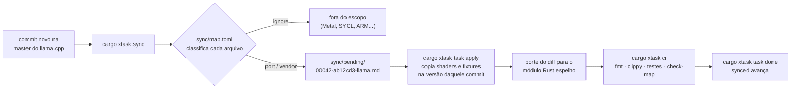

# llama.rs

> **O llama.cpp, arquivo por arquivo, em Rust — sempre a um `cargo xtask sync` da master.**


A maioria dos ports é uma fotografia: copia uma versão, diverge no dia seguinte e envelhece.
Este é um **espelho que acompanha o original**. Cada arquivo C/C++ do
[llama.cpp](https://github.com/ggml-org/llama.cpp) tem um módulo Rust com o mesmo nome. Cada
commit novo na master do upstream vira uma tarefa de porte, com o diff dentro. E quem decide
se o Rust está certo é o próprio C++, compilado no mesmo SHA.

---

## A ideia em cinco linhas

| | |
|---|---|
| 🪞 **Espelho, não reescrita** | `src/llama-vocab.cpp` → `crates/llama/src/llama_vocab.rs`. Cada função traz `/// upstream: <símbolo C++>`, na mesma ordem do original. |
| 🔁 **A master manda** | `cargo xtask sync` lê os commits novos do llama.cpp e gera uma tarefa por commit × crate em `sync/pending/`. |
| ⚖️ **O C++ é o juiz** | `cargo xtask oracle-build` compila o upstream no mesmo SHA. Tokenizer e quantização batem bit a bit; ops e logits batem por NMSE/top-1. |
| 🧩 **Kernels verbatim** | Os shaders Vulkan (`.comp`) e os kernels HIP (`.cu`) são copiados sem tocar. Só o código host vira Rust, e todo o tuning do upstream vem junto. |
| 🎯 **Feito para uma máquina** | 2× Xeon E5-2680 v4 (AVX2) + 2× AMD MI50 (gfx906): CPU + Vulkan + HIP, nada além. |

---

## Como um commit do llama.cpp vira Rust



Três garantias seguram esse ciclo:

- **Nada passa sem classificação.** Se o upstream cria um arquivo que nenhuma regra cobre, o
  `check-map` falha. Ninguém descobre seis meses depois que um arquivo novo ficou para trás.
- **Ordem por crate.** As tarefas de uma crate fecham na ordem dos commits, e o `task done`
  recusa pular uma.
- **Interrupção não corrompe o estado.** O sync grava o progresso a cada commit, não duplica
  tarefas quando é reexecutado e recusa um `UPSTREAM.toml` com erro de digitação.

---

## Escopo em números

Classificação de todos os arquivos do upstream em `ec7630a`, saída real do
`cargo xtask check-map`:

| Ação | Arquivos | O que acontece |
|---|---:|---|
| `port` | **318** | traduzido para Rust, módulo a módulo |
| `vendor` | **610** | copiado verbatim (shaders Vulkan, kernels HIP, fixtures, suíte pytest do server) |
| `ignore` | **2741** | fora do escopo (outros backends, conversão Python, exemplos, CI) |
| **total** | **3669** | **100% classificado** |

<details>
<summary>Por crate</summary>

| Crate | port | vendor |
|---|---:|---:|
| `common` | 110 | 72 |
| `llama` | 81 | 12 |
| `ggml-cpu` | 33 | — |
| `ggml` | 27 | — |
| `llama-server` | 25 | 40 |
| `mtmd` | 20 | 8 |
| `ggml-vulkan` | 8 | 192 |
| `llama-cli` | 8 | — |
| `llama-bench`, `llama-completion`, `llama-perplexity` | 2 cada | — |
| `ggml-hip` | — | 286 |

</details>

Ritmo do upstream, medido nos 30 dias até 2026-10-01: **595 commits**, dos quais **~240 tocam o
escopo** (~8 por dia) e **84 só mexem em shaders/kernels**.

**Modelos no escopo:** Llama, Qwen2/2.5, Qwen3, Qwen3.5/3.8 (híbrido atenção + gated delta-net,
com MTP) e multimodal da família Qwen.
**Ferramentas:** `llama-cli`, `llama-completion`, `llama-server` (API OpenAI), `llama-bench` e
`llama-perplexity`.

---

## Comece aqui

```bash
# toolchain fixa do projeto
rustup toolchain install 1.99.0 --component rustfmt --component clippy

# o portão: fmt + clippy -D warnings + testes + check-map
cargo xtask ci

# quão atrás da master estamos? (só lê; não grava nada)
cargo xtask sync --dry-run | head -1

# compila o llama.cpp no SHA do sync como oráculo (CPU + Vulkan, com cache por SHA)
cargo xtask oracle-build
```

Requisitos para o oráculo: `cmake`, `glslc` e os headers do Vulkan. O primeiro `check-map`
clona o upstream em `.upstream/llama.cpp` (~380 MB).

> **No M0, rode o `sync` sempre com `--dry-run`.** Sem crates registradas em `UPSTREAM.toml`,
> um sync de verdade moveria o cursor para depois do baseline.

<details>
<summary>Todos os comandos do <code>cargo xtask</code></summary>

| Comando | Faz |
|---|---|
| `ci` | `fmt --check`, `clippy -D warnings`, testes e `check-map` |
| `check-map [--rev <rev>]` | confere que todo arquivo do upstream casa uma regra de `sync/map.toml` |
| `sync [--dry-run]` | gera as tarefas dos commits novos da master, por crate registrada |
| `task apply <tarefa>` | copia os arquivos vendor da tarefa na versão do commit dela |
| `task done <tarefa>` | fecha a tarefa (na ordem) e recalcula o `synced` |
| `oracle-build [rev]` | compila o upstream em `.upstream/build-<sha7>/` |

</details>

---

## Anatomia de uma tarefa de sync

*Exemplo ilustrativo do formato que o `sync` gera:*

```markdown
+++
seq = 42
sha = "ab12cd3…"
crate = "ggml-vulkan"
subject = "vulkan: fuse rms_norm + mul"
port = ["ggml/src/ggml-vulkan/ggml-vulkan.cpp"]
vendor = ["ggml/src/ggml-vulkan/vulkan-shaders/rms_norm_mul.comp"]
vendor_deleted = []
+++

# vulkan: fuse rms_norm + mul (upstream ab12cd3)

## Portar
- `ggml/src/ggml-vulkan/ggml-vulkan.cpp` → `crates/ggml-vulkan/src/ggml_vulkan.rs`

## Vendor
Rodar `cargo xtask task apply sync/pending/00042-ab12cd3-ggml-vulkan.md`

## Fechar
1. `cargo xtask ci` verde
2. `cargo xtask task done sync/pending/00042-ab12cd3-ggml-vulkan.md`
3. commit `sync(ggml-vulkan): vulkan: fuse rms_norm + mul (upstream ab12cd3)`

## Diff (só os arquivos a portar)
~~~diff
…
~~~
```

O front matter é TOML, para a máquina; o corpo é Markdown, para quem porta. Um agente
consegue pegar a tarefa, portar, validar e fechar sem ler mais nada.

---

## Estado e roteiro

| Marco | Entrega | Estado |
|---|---|---|
| **M0** | workspace Rust 1.99 + `cargo xtask` (sync, check-map, oracle-build, ci) | ✅ concluído |
| M1 | `stories260K` gera saída idêntica ao upstream na CPU | ⏭️ próximo |
| M2 | Qwen2.5-0.5B e Qwen3-0.6B na CPU (Q8_0, Q4_K, Q5_K, Q6_K) + cli | |
| M3 | Vulkan nas MI50, ≥ 95% do desempenho do upstream | |
| M4 | Qwen3.5/3.8 + MTP, server (suíte pytest do upstream), perplexity, bench | |
| M5 | multimodal (mtmd) | |
| M6 | ilha HIP: `ggml-cuda` verbatim atrás de uma ponte C | |

O caminho crítico é sequencial: contratos (`ggml.h`, `ggml-backend-impl.h`, `llama.h`) →
núcleo do ggml → backend CPU → `llama` → primeiro token. Fora dele, as trilhas andam em
paralelo, um agente e um worktree por crate. O detalhe está no
[spec §6](docs/superpowers/specs/2026-10-01-llama-rs-port-design.md).

---

## Estrutura

```
llama.rs/
├─ UPSTREAM.toml        estado do sync: cursor, synced, crates registradas
├─ sync/map.toml        a decisão de escopo: caminho do upstream → port | vendor | ignore
├─ sync/pending/        tarefas de porte geradas pelo sync (nasce com a 1ª tarefa)
├─ vendor/upstream/     cópias verbatim: shaders, kernels, fixtures (nasce com o 1º apply)
├─ xtask/               a automação inteira (hoje: o único crate)
└─ crates/              a partir do M1: ggml, ggml-cpu, ggml-vulkan, ggml-hip, llama,
                        common, mtmd, llama-cli, llama-server, llama-bench, …
```

---

## Regras da casa

- **Rust estável mais recente, fixado** em `rust-toolchain.toml`. As dependências ficam
  sempre na última versão publicada.
- **`unsafe` negado no workspace.** Ele só é liberado onde é inevitável (SIMD, Vulkan, FFI e
  mmap), e cada bloco precisa de um comentário `// SAFETY:`.
- **Nada entra sem `cargo xtask ci` verde.**
- **Componentes caseiros do upstream são portados, não trocados por crates.** Jinja, regex de
  pré-tokenização e parsers de chat continuam iguais ao original, para que o diff seguinte
  caia no mesmo lugar.
- **Desempenho segue o que foi medido.** As práticas valem só com evidência, conforme
  [`docs/rust-praticas-da-documentacao.md`](docs/rust-praticas-da-documentacao.md).

---

## Documentos

- [Design: escopo, arquitetura, sync, testes e paralelismo](docs/superpowers/specs/2026-10-01-llama-rs-port-design.md)
- [Plano do M0](docs/superpowers/plans/2026-10-01-m0-workspace-xtask.md)
- [Rust: memória, velocidade e más práticas segundo a documentação oficial](docs/rust-praticas-da-documentacao.md)

## Licença

Ainda não definida para o código deste repositório. Os arquivos em `vendor/upstream/` vêm do
[llama.cpp](https://github.com/ggml-org/llama.cpp) e seguem a licença MIT dele.
