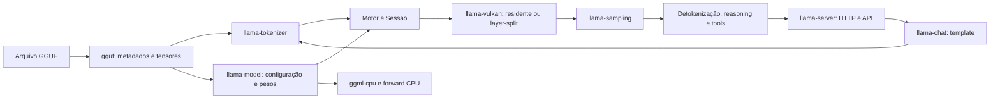
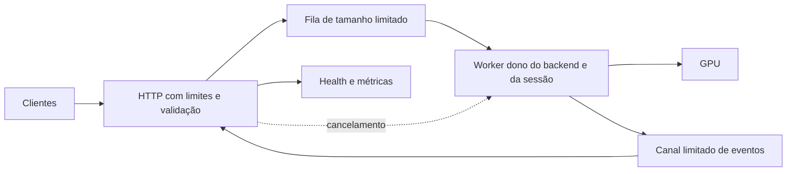

# Análise do llama.rs e comparação com práticas da indústria

**Comece pelos itens E01–E03: limites do MTP, semântica de `stop` e disponibilidade do HTTP.** Eles afetam respostas corretas e atendimento das requisições.

Data: **25/09/2026**. Revisão analisada: `5206197cd4a4804dc0f08d6fba0c86075a6f50be`.

## 1. Diagnóstico e escopo

O projeto tem uma proposta técnica coerente: controlar a inferência em Rust e os kernels Vulkan para extrair desempenho de GPUs AMD gfx906. A separação em crates, os testes diferenciais e o registro de experimentos dão uma boa base para continuar. **A prioridade recomendada é tornar esse runtime especializado confiável para o uso local com agentes, mantendo o foco nas MI50/MI60.**

Há, contudo, erros concretos na geração e na camada HTTP, lacunas nas validações e inconsistências na documentação. Os resultados de velocidade registrados são promissores em alguns modelos, mas ainda não sustentam uma conclusão geral de superioridade sobre outros runtimes.

### O que esta análise verificou

| Frente | Evidência e limite |
|---|---|
| Código | Leitura dos caminhos GGUF → configuração/pesos → sessão → Vulkan e HTTP → chat → geração; revisão de testes, manifests, scripts e documentação. Não é uma auditoria exaustiva de cada shader. |
| Navegação | GitNexus: consulta de fluxos e contexto de `Motor::responder`; CodeGraph: confirmação do caminho até `passo_mtp` e `verify_shard`. O índice GitNexus aponta para `90e56c5`; a diferença até o HEAD analisado contém somente AGENTS.md e CLAUDE.md. |
| Execução | `cargo test --offline --locked -p llama-server -p gguf`: **82 testes passaram**, zero falhas. O modelo `stories260K.gguf` e a referência de metadados estavam presentes. |
| Revisão independente | Uma segunda leitura confirmou os achados sobre MTP, `stop`, HTTP, configuração delta-net e liberação de recursos Vulkan. |
| Pesquisa externa | Documentação oficial de llama.cpp, vLLM, SGLang, Candle, Axum e RFC HTTP. Fontes consultadas nesta data e ligadas às respectivas conclusões abaixo. |

**Limites:** não foram executados benchmarks novos, testes em GPU, gate completo, medição de cobertura ou auditoria de vulnerabilidades das dependências. Os números de GPU citados são registros do próprio repositório. “Confirmado por inspeção” significa que o fluxo está demonstrado no código; não significa reprodução em hardware nesta sessão. Esta entrega contém análise e recomendações; as correções propostas ainda precisam ser implementadas.

Leitura por objetivo:

1. [Entender a arquitetura e os prós e contras](#2-arquitetura-prós-e-contras).
2. [Comparar com outros projetos](#3-o-que-aproveitar-das-referências-da-indústria).
3. [Ver os erros e suas evidências](#4-erros-e-riscos-priorizados).
4. [Executar os próximos passos](#5-próximos-passos).
5. [Definir medições e decisões técnicas](#6-como-decidir-as-próximas-otimizações).

## 2. Arquitetura, prós e contras

O workspace possui nove crates de runtime e um crate `oracle`. O fluxo principal é:

Fontes locais: [Cargo.toml](../Cargo.toml), [Motor](../crates/llama-server/src/motor.rs), [Sessao](../crates/llama-model/src/sessao.rs), [contrato do backend](../crates/llama-model/src/gpu.rs) e [layer-split](../crates/llama-vulkan/src/layer_split.rs).

### Pontos fortes a preservar

| Ponto forte | Evidência | Benefício |
|---|---|---|
| Separação por responsabilidade | Crates próprios para formato, tokenizer, chat, modelo, sampling e backend; `GpuResidentDecode` em `gpu.rs:379`. | Permite testar a lógica do servidor com um backend simulado e evoluir o Vulkan com menos acoplamento ao HTTP. |
| Cuidados com parsing e memória | `gguf/src/reader.rs`, `parse.rs:32` e `file.rs:47`: leituras limitadas, aritmética verificada e arrays sem pré-alocação baseada cegamente na entrada. | Arquivos truncados e tamanhos inválidos podem virar erros controlados. Dados dos tensores são acessados por slices; metadados ainda têm alocações próprias. |
| Testes que comparam comportamentos | `oracle`, referências em `refs/`, `gguf/tests/fuzz_parse.rs`, `llama-cli/tests/greedy_gate.rs` e `llama-chat/tests/qwen38_template.rs`. | Comparação com oráculo e Jinja é mais forte que testar apenas detalhes internos. Os proptests exercitam entradas arbitrárias, embora não substituam fuzzing contínuo. |
| Especialização sustentada por medições locais | Repack de quantizados, orçamento de VRAM, distribuição de camadas, prefill em blocos e GEMM Q4_K; registros em `docs/estrategia-inferencia-mi50.md` e `docs/prefill-em-batch.md`. | O trabalho ataca custos concretos de banda, transferência e ocupação no hardware escolhido. |
| Tratamento explícito do estado híbrido | `Sessao::prefill`, `marcar` e `restaurar`, além do rollback do MTP. | Reconhece que o estado recorrente do delta-net também precisa ser restaurado quando o histórico diverge. |

### Custos e limitações da escolha atual

| Limitação | Consequência | Avaliação |
|---|---|---|
| Backend especializado em AMD | A enumeração filtra o fabricante em `device.rs`; a validação documentada é em gfx906. | É uma escolha de produto defensável. Ampliar suporte exige uma matriz explícita de capacidades e testes por GPU. |
| Manutenção de toda a cadeia | Parser, tokenizer, template, sampling e shaders próprios. | Dá controle, mas cada arquitetura nova aumenta o custo de acompanhar formatos e provar correção. |
| Uma sessão e atendimento serial | `Motor` mantém uma `Sessao`; `servidor::laco` atende uma conexão inteira antes da próxima. | Serve um cliente local simples; limita disponibilidade, fila e uso por vários clientes. |
| Desempenho desigual | O benchmark local registra derrotas em Qwen2.5-14B Q8_0, Qwen2.5-0.5B e CPU quantizada. | A vantagem precisa ser descrita por modelo, quantização, contexto e hardware. |
| Estado operacional menos desenvolvido | HTTP manual, ausência de CI versionada identificável e rotinas com validação opcional. | O esforço seguinte precisa incluir confiabilidade e evidência reproduzível. |

### O que os benchmarks locais permitem concluir

Em [benchmarks.md](benchmarks.md), o Qwen3.8-27B Q4_K_M registra **26,9 tok/s** no llama.rs, enquanto o llama.cpp aparece em intervalos de **17,0–20,6** com Vulkan e **19,5–23,1** com HIP/configuração MTP. O documento também informa diferenças de profundidade de contexto entre medições. Esses números sustentam uma hipótese de vantagem nesse cenário, a ser confirmada em comparação controlada.

O mesmo documento registra **28,0 contra 40,59 tok/s** para Qwen2.5-14B Q8_0 e **123 contra 334 tok/s** para Qwen2.5-0.5B Q8_0. A publicação dessas derrotas ajuda a delimitar onde a especialização está funcionando.

O relato de prefill de 9.312 tokens a aproximadamente **12,75 ms/token**, cerca de dois minutos antes da resposta sem cache, em [servidor-opencode.md](servidor-opencode.md), torna o tempo até a primeira resposta uma prioridade para uso com agentes. É uma medição histórica via CLI, não um benchmark novo de latência HTTP.

## 3. O que aproveitar das referências da indústria

“Padrão da indústria” aqui significa práticas documentadas em projetos de referência. Não existe uma arquitetura universalmente melhor para qualquer GPU e carga.

### Projetos comparados

| Referência | Prós relevantes | Custos e limites para este projeto | O que aproveitar |
|---|---|---|---|
| **llama.cpp** | Ecossistema GGUF e servidor com batching contínuo, múltiplas sequências e monitoramento. | A implementação atende muitos cenários; a própria comparação local mostra resultados diferentes conforme modelo e backend. | Principal baseline no mesmo hardware, contratos de API e metodologia de benchmark. [Servidor](https://github.com/ggml-org/llama.cpp/tree/master/tools/server), [llama-bench](https://github.com/ggml-org/llama.cpp/tree/master/tools/llama-bench). |
| **vLLM** | Reuso de prefixos e escalonamento de prefill/decode documentados. | A lista oficial consultada de GPUs AMD não inclui MI50/gfx906; não há base aqui para recomendar migração direta nesse hardware. | Separar métricas de prefill/decode, estudar fila e cache. [Prefix caching](https://docs.vllm.ai/en/stable/features/automatic_prefix_caching/), [otimização](https://docs.vllm.ai/en/stable/configuration/optimization/), [hardware](https://docs.vllm.ai/en/stable/getting_started/installation/gpu/). |
| **SGLang** | RadixAttention, batching contínuo e saídas estruturadas fazem parte do runtime documentado. | O escopo de serving é maior; a apresentação oficial destaca AMD MI300/MI355, sem comprovar um caminho pronto para gfx906. | Gestão de prefixos e garantia de formato de saída como referências futuras. [Projeto oficial](https://github.com/sgl-project/sglang). |
| **Candle** | Referência de framework ML em Rust, com separação entre núcleo, operações e modelos. | Adotá-lo exigiria avaliar como integrar ou preservar os kernels Vulkan específicos deste projeto. | Organização de interfaces e modelos, composição de crates e tratamento de erros. [Projeto oficial](https://github.com/huggingface/candle). |

### Práticas com aplicação concreta

| Prática | Aplicação recomendada | Custo ou condição |
|---|---|---|
| Biblioteca HTTP consolidada | Avaliar Axum/Hyper para transporte, roteamento e middleware, mantendo o motor atrás de uma fila limitada. Axum integra o ecossistema Tower. [Documentação](https://docs.rs/axum/latest/axum/). | Dependências e uma fronteira de execução adicionais; limites, cancelamento e política de fila continuam sendo responsabilidade da aplicação. |
| Batching contínuo | Só estudar após medir demanda concorrente e estabilizar estados por sessão. | Exige isolamento de KV/estado recorrente e novos caminhos de execução. Não basta criar threads em torno da sessão atual. |
| Prefill em blocos e cache de prefixo | Aperfeiçoar o que já existe, começando pelo tempo de prompt longo e pela taxa real de reuso. | Cache de prefixo poupa prefill; não acelera por si só a geração de novos tokens. [vLLM APC](https://docs.vllm.ai/en/stable/features/automatic_prefix_caching/). |
| Métricas separadas | Medir fila, prefill, primeiro evento útil, intervalo entre tokens, memória e cancelamento. | Requer definir relógios e fronteiras; uma taxa agregada de tok/s esconde gargalos. |
| Benchmark reproduzível | Registrar revisões, configurações, aquecimento, repetições e resultados estruturados. | Usa tempo de GPU, mas permite decidir se uma otimização merece ser mantida. O `llama-bench` oferece repetições e formatos como JSON/CSV. [Documentação](https://github.com/ggml-org/llama.cpp/tree/master/tools/llama-bench). |

**Duas distinções técnicas mudam as decisões:**

Um decode individual limitado por banda **não demonstra que batching de sequências seja inútil**. Um kernel em lote pode amortizar leituras de pesos entre sequências; o custo de memória, a latência e a implementação determinam o ganho real. Isso justifica um experimento futuro, não uma promessa de aceleração. A documentação do vLLM descreve o compromisso entre prefill, decode e orçamento de tokens do lote. [Otimização do vLLM](https://docs.vllm.ai/en/stable/configuration/optimization/).

Da mesma forma, paginar o KV de atenção não resolve sozinho a restauração do delta-net. O desenho local de snapshots trata um problema real da arquitetura híbrida. Uma evolução para cache de vários prefixos precisa representar também o estado recorrente e o custo de armazenar cada snapshot.

## 4. Erros e riscos priorizados

**P1:** corrigir antes de ampliar uso ou otimizações que dependam desse comportamento. **P2:** resolver no ciclo de estabilização. **P3:** manutenção/distribuição. Não foi estabelecido um achado P0 nesta amostra.

### 4.1 Correção e atendimento das requisições

#### E01 — P1: MTP falha perto do limite de contexto

**Confirmado por inspeção e revisão independente.** Em [motor.rs:133](../crates/llama-server/src/motor.rs#L133), o teto limita tokens emitidos. Porém, após emitir um token, o motor chama `passo_mtp` em `motor.rs:178` sem verificar novamente esse teto ou o espaço necessário para a proposta. [gpu.rs:734](../crates/llama-model/src/gpu.rs#L734) sempre propõe dois tokens e verifica três. [verify_shard:4773](../crates/llama-vulkan/src/resident_forward.rs#L4773) recusa `pos0 + VERIFY_TOK > ctx`.

**Gatilho:** MTP ativo, prompt com `ctx - 1` tokens, `max_tokens = 1` e primeiro token que não seja EOS nem acione `stop`. Há espaço para a resposta pedida, mas a verificação de três tokens falha. O caminho sem streaming transforma esse erro em HTTP 500; no streaming pode haver conteúdo seguido de erro SSE.

**Segundo limite a tratar:** a cabeça MTP tem cache próprio. [propor_mtp:3378](../crates/llama-vulkan/src/resident_forward.rs#L3378) recusa propostas quando esse cache chega a `ctx`, e `:3413` avança uma posição por proposta. Como cada passo faz duas propostas, gerações com muitas rejeições podem esgotar esse cache antes do principal. O número exato de tokens emitidos depende das aceitações e do histórico; não foi medido nesta sessão.

**Correção proposta:** verificar término e cancelamento antes de iniciar outro passo; selecionar decode comum quando faltar espaço para o bloco MTP ou para o cache da cabeça. Definir a política de renovação desse cache. Preservar a coerência entre tokens emitidos, tokens já no cache e logits ao encerrar.

**Critério de aceite:** casos em `ctx - 1`, `ctx - 2` e `ctx - 3`, com MTP ligado/desligado, encerram com `length` ou EOS apropriado, sem erro de backend; a próxima requisição continua coerente. Reproduzir primeiro com backend simulado e depois nas GPUs.

#### E02 — P1: a sequência de `stop` vaza para o conteúdo

**Confirmado por inspeção e pelo teste existente executado.** [motor.rs:163](../crates/llama-server/src/motor.rs#L163) registra e emite os eventos antes de chamar `parou_em_sequencia`. O teste [motor_fake.rs:76](../crates/llama-server/tests/motor_fake.rs#L76) pede `PARE` como parada e exige `conteudo.contains("PARE")`.

**Impacto:** o cliente recebe o delimitador que deveria encerrar a saída. Se um fragmento contiver texto depois dele, esse texto também pode sair antes da checagem. A referência do llama.cpp exclui a palavra de parada do conteúdo retornado. [Contrato de saída](https://github.com/ggml-org/llama.cpp/tree/master/tools/server).

**Correção proposta:** detectar paradas antes da emissão, mantendo pendente o sufixo que ainda possa formar uma sequência de parada. Cortar no primeiro delimitador completo. Fazer apenas um `truncate` no resultado final não recupera bytes já enviados por SSE.

**Critério de aceite:** o cenário `xxPAREyy` retorna somente `xx`, com e sem streaming. Cobrir parada dividida entre tokens, várias paradas, Unicode e finalização do buffer pendente.

#### E03 — P1: um cliente lento pode bloquear todo o servidor

**Confirmado por inspeção.** [servidor.rs:19](../crates/llama-server/src/servidor.rs#L19) atende conexões em série. `atender`, em `:32`, não configura timeout de leitura/escrita. [http.rs:35](../crates/llama-server/src/http.rs#L35) usa `read_line` sem limite para linha inicial/cabeçalhos; o limite de 32 MiB vale somente para o corpo.

**Gatilho e impacto:** uma conexão que não termine os cabeçalhos mantém o único atendimento esperando. `/health` e as gerações seguintes também esperam. Durante geração ou escrita bloqueada, o healthcheck compartilha o mesmo problema. Uma linha única muito grande pode crescer em memória além do limite do corpo.

Há também um erro de protocolo em `http.rs:61`: `Content-Length` inválido vira zero e valores duplicados conflitantes são sobrescritos. A RFC determina tratamento de comprimento inválido como erro, com resposta 400 e fechamento. Não foi demonstrado um ataque de request smuggling nesta análise. [RFC 9112, seção 6.3](https://www.rfc-editor.org/rfc/rfc9112.html#section-6.3).

**Correção proposta:** primeiro impor limites de linha/cabeçalhos e prazos de leitura/escrita, rejeitando comprimentos inválidos. Depois separar atendimento HTTP e inferência, com fila limitada, resposta de ocupação e cancelamento. O padrão de bind em localhost reduz exposição de rede, mas não evita travamento por cliente local.

**Critério de aceite:** cliente parado é encerrado no prazo configurado; uma geração longa não impede `/health`; excesso de fila recebe erro previsível; desconexão cancela trabalho em fronteiras seguras do prefill/decode.

#### E04 — P2: metadados delta-net inválidos passam pela configuração

**Confirmado por inspeção.** [config.rs:127](../crates/llama-model/src/config.rs#L127) lê `ssm.time_step_rank` e `ssm.group_count` sem exigir valores positivos. `DeltaNetConfig::head_v_dim`, em `:39`, divide por `n_v_heads`; um zero causa pânico quando a carga de uma camada linear usa esse método. Há divisões por `n_k_heads` nos caminhos Vulkan de delta-net (`resident_forward.rs:2408` e `:2607`), embora outra validação de tensor possa falhar antes de alcançá-las. O parsing da configuração isoladamente aceita os zeros; o pânico ocorre no uso posterior.

**Impacto:** um GGUF estruturalmente parseável, mas com configuração inválida, pode falhar por pânico durante a carga. A robustez do parser de bytes não garante a validade matemática do modelo. O gatilho depende do arquivo carregado, não de uma mensagem HTTP comum.

**Correção proposta:** centralizar invariantes de configuração: dimensões positivas, divisibilidades exigidas, limites de contexto, índices de tokens e aritmética verificada para tamanhos. Produzir erro que identifique a chave inválida antes de alocar grandes buffers.

**Critério de aceite:** GGUFs sintéticos com grupos/cabeças zerados ou incompatíveis retornam `ModelError::Config`, sem pânico e sem iniciar carga na GPU.

#### E05 — P2: a API aceita parâmetros sem garantir sua semântica

**Confirmado por inspeção.** [api.rs:67](../crates/llama-server/src/api.rs#L67) usa conversões opcionais e defaults: `max_tokens: -1`, por exemplo, não vira erro; é tratado como ausente. Temperatura e `top_p` não têm validação explícita de faixa. O campo `model` é lido, mas o roteamento não o compara ao modelo servido. Campos como `n` e `response_format` não têm tratamento nesse parser.

Além disso, [servidor.rs:100](../crates/llama-server/src/servidor.rs#L100) transforma qualquer erro do motor em 500, inclusive prompt que excede o contexto; em `:124`, abre SSE 200 antes dessa validação. Isso mistura erro do pedido com falha interna e dificulta clientes que decidem tentativas pelo status HTTP.

**Correção proposta:** declarar um subconjunto compatível e validar os parâmetros que mudam a resposta. Rejeitar explicitamente pedidos de recursos não suportados, em vez de produzir uma resposta que parece atendê-los. Validar contexto/modelo antes de abrir o stream e mapear erros de entrada para 4xx.

**Critério de aceite:** matriz de contratos para modelo inexistente, números inválidos, `n > 1`, saída estruturada não suportada e contexto excedido. Comportamento equivalente nos modos JSON e SSE antes do primeiro evento.

### 4.2 Sustentação, evidência e manutenção

#### E06 — P2: recursos Vulkan ficam sem limpeza em falhas de construção

**Confirmado por inspeção; impacto em falhas de inicialização.** Em [device.rs:209](../crates/llama-vulkan/src/device.rs#L209), o device é criado antes de `create_command_pool(...)?`; se a segunda operação falha, o wrapper com `Drop` ainda não existe. Em [resident_forward.rs:223](../crates/llama-vulkan/src/resident_forward.rs#L223), ocorre o equivalente entre criar um buffer e alocar/vincular memória. Em [tensor.rs:279](../crates/llama-vulkan/src/tensor.rs#L279), a memória já foi alocada quando uma falha em `bind_buffer_memory` retorna sem liberá-la.

**Impacto:** recursos criados parcialmente podem permanecer alocados até a destruição do dono Vulkan apropriado ou o encerramento do processo. Isso prejudica especialmente tentativas de carga após falhas de memória. Não há evidência aqui de vazamento por token no caminho de sucesso.

**Correção proposta:** guardas de construção e propriedade explícita dos recursos, com limpeza automática em retornos antecipados. Evoluir interfaces seguras que vinculem contexto, device e alocações ao respectivo dono.

**Critério de aceite:** falhas induzidas em criação/alocação/bind não deixam objetos vivos indevidamente; validation layers não reportam violações na construção/destruição. Verificar na GPU antes de considerar concluído.

#### E07 — P2: o gate pode ficar verde sem validar partes relevantes

**Confirmado por scripts/manifests.** [scripts/gate.sh:6](../scripts/gate.sh#L6) executa fmt, Clippy e testes, mas não habilita `gpu` em CLI/servidor. O crate Vulkan é membro do workspace e participa, porém isso não cobre automaticamente os ramos desses binários protegidos pela feature. Em `gate.sh:25`, a ausência de `cargo-llvm-cov` apenas gera aviso e ainda termina em `GATE OK`.

Testes diferenciais como [greedy_gate.rs:16](../crates/llama-cli/tests/greedy_gate.rs#L16) retornam normalmente quando faltam modelo/referência. Testes Vulkan também usam retornos antecipados sem hardware. O executor pode contabilizar esses casos como aprovados. Não foram encontrados workflows de CI rastreados nas localizações convencionais verificadas; isso não comprova ausência de automação externa.

**Correção proposta:** dividir validação rápida sem GPU e validação obrigatória no hardware de referência; declarar fixtures obrigatórias em cada modalidade. Compilar explicitamente CLI e servidor com `gpu`. Tornar ausência de cobertura uma condição explícita do resultado, não uma aprovação equivalente.

**Critério de aceite:** relatório diferencia “executado”, “indisponível” e “falhou”; a validação GPU exige modelos e dispositivos esperados; CI publica resultado e artefatos das revisões testadas.

#### E08 — P2: benchmarks não oferecem controle suficiente para a conclusão geral

**Confirmado por inspeção dos registros e scripts.** [benchmarks.md](benchmarks.md) combina condições de contexto distintas. Em [benchmark-gpu.sh](../scripts/benchmark-gpu.sh), `BENCH_REPS` é aplicado ao `llama-bench`, enquanto os caminhos Rust são chamados uma vez por modo. O script compara geração sintética com `-p 0` no C++ com um prompt textual no Rust e captura taxas de logs; também tolera saída não zero com `|| true`.

**Impacto:** dispersão, trabalho efetivamente realizado e diferenças de medição ficam parcialmente misturados ao efeito da implementação. Isso não invalida todos os resultados existentes, mas limita sua comparabilidade.

**Correção proposta:** manter experimentos históricos e adicionar uma matriz padronizada com mesma tarefa, hash do modelo, contexto, tokens realmente gerados, versões, driver, split, cache e modo de sampling. Falhas devem ser resultados inválidos explícitos.

**Critério de aceite:** pelo menos cinco repetições por condição nos dois runtimes, política idêntica de aquecimento e JSON/CSV por execução. Reportar mediana e dispersão; medir caudas de latência com uma amostra maior que cinco requisições.

#### E09 — P2: documentação contradiz funcionalidades e custos atuais

**Confirmado por comparação com o código.** Estas divergências podem induzir decisões erradas de uso e planejamento:

| Documento | Divergência | Estado observado |
|---|---|---|
| [README](../README.md), tabela de estado, e [mtp-implementacao.md](mtp-implementacao.md) | O README diz que MTP não existe; o documento de implementação ainda descreve o motor do servidor como token a token. | `main.rs:36` oferece `--mtp`; motor, sessão e backend têm proposta/verificação. Está desligado por padrão e tem o erro E01. |
| [servidor-opencode.md](servidor-opencode.md), pendências | GEMM ainda aparece como opt-in e a escolha de bloco como não medida. | `resident_forward.rs:39` usa 24 por padrão; `:121` habilita GEMM salvo valor `0`. |
| [prefill-em-batch.md](prefill-em-batch.md) | Abertura e trechos dizem token a token, batch 8 e GEMM desligado; mais abaixo registram a adoção de 24 + GEMM. | Mistura desenho histórico e instruções correntes no mesmo documento. |
| [servidor-opencode.md:106](servidor-opencode.md#L106) e ajuda de `--ctx` | Texto diz 136 KB/token; tabela atual de cache f16 indica aproximadamente metade. | O backend aloca K e V com dois bytes por elemento em `resident_forward.rs:1567`. Recalcular usando configuração efetiva e separar MB/MiB e snapshots/MTP. |

**Correção proposta:** criar uma página curta de capacidades vigentes, com versão, defaults e limites; marcar documentos de experimentos como históricos. Derivar ou conferir números de memória contra a mesma configuração usada pelo backend.

**Critério de aceite:** README, `--help`, defaults e documentação concordam; cada benchmark aponta para revisão e configuração.

#### E10 — P3: concentração de código e lacunas de distribuição

[resident_forward.rs](../crates/llama-vulkan/src/resident_forward.rs) tem **5.494 linhas**, incluindo testes, e concentra buffers, planos, execução, atenção, delta-net, MTP e profiling. O tamanho é um indicador de custo de revisão, não prova isolada de erro. Refatorar sem regressões numéricas e medições confiáveis aumentaria o risco.

Em [llama-vulkan/Cargo.toml](../crates/llama-vulkan/Cargo.toml), `unsafe_code` é permitido e não há herança dos lints do workspace; portanto, as proibições específicas de Clippy declaradas na raiz não são todas aplicadas automaticamente a esse crate. Exceções de FFI são necessárias, mas devem ser intencionais e localizadas.

Para distribuição, o README declara MIT, mas não foi encontrado arquivo de licença rastreado, e os manifests examinados não declaram `license`. [`.cargo/config.toml`](../.cargo/config.toml) usa `target-cpu=native`, apropriado ao uso local, mas exige uma estratégia diferente para distribuir binários a CPUs distintas.

O README declara Rust mínimo 1.96+, enquanto o toolchain de desenvolvimento fixa 1.98.0. Essas escolhas podem coexistir; falta nesta análise uma execução na versão mínima para confirmar a promessa de compatibilidade. Acrescentar essa verificação à matriz de distribuição.

**Correção proposta:** após a estabilização, extrair módulos por responsabilidade, preservar lints úteis no Vulkan e documentar suas exceções. Completar metadados/arquivo de licença e separar builds locais dos distribuíveis.

**Critério de aceite:** mudanças de organização preservam interfaces e resultados; build distribuível tem requisitos explícitos; pacote contém a licença declarada e metadados coerentes.

## 5. Próximos passos

Estimativas para **uma pessoa familiarizada com Rust/Vulkan**, em dias úteis de trabalho. Exigem disponibilidade das GPUs nas etapas indicadas; são faixas de planejamento, não garantias.

| Ordem | Entrega delimitada | Esforço | Critério para concluir |
|---|---|---|---|
| **1** | Corrigir limites de MTP e `stop` — E01/E02. | **1–3 dias** | Regressões demonstram a falha anterior; JSON/SSE respeitam parada; fronteiras de contexto e próximo turno funcionam em backend simulado e GPU. |
| **2** | Estabilizar HTTP e contratos de entrada — E03/E05. | **2–4 dias** | Timeouts e limites ativos; `/health` responde durante geração; fila limitada; erros 4xx antes de SSE; cancelamento definido. |
| **3** | Validar configuração e construção Vulkan — E04/E06. | **2–4 dias** | GGUF inválido produz erro tipado; falhas parciais de inicialização liberam recursos; validation layers verificadas. |
| **4** | Tornar validação, documentação e benchmark reproduzíveis — E07/E08/E09. | **3–5 dias**, mais execuções GPU | Gates CPU/GPU distinguem falta de pré-requisito; documentação corrente; matriz comparável salva com revisões e dados brutos. |
| **5** | Otimizar o gargalo medido e reduzir custo de manutenção — E10 e seção 6. | **5–10 dias** por ciclo focado | Uma hipótese por experimento; ganho repetível na carga escolhida; correção preservada; refatoração limitada aos componentes envolvidos. |

### Desenho recomendado para o servidor

Separar transporte e inferência permite atender healthchecks e impor políticas de fila mesmo com uma geração por vez:

O worker deve possuir os objetos Vulkan e controlar seu uso. Construir o backend dentro desse contexto de execução evita presumir que objetos com ponteiros mapeados ou estado interior sejam livremente transferíveis entre threads. A proposta precisa definir prazos e cancelamento por fase; `spawn_blocking` isoladamente não fornece essas garantias.

Para múltiplos diálogos, começar com uma política explícita de sessão/cache. Só introduzir várias sessões residentes quando houver orçamento medido para KV e snapshots recorrentes.

## 6. Como decidir as próximas otimizações

### Matriz mínima de avaliação

| Dimensão | Casos propostos |
|---|---|
| Modelos | Qwen3.8-27B Q4_K_M como alvo principal; Qwen2.5-14B Q8_0 como regressão de uma GPU; modelo pequeno como diagnóstico de overhead. |
| Prompts | Curto, aproximadamente 2K, 8K e 16K tokens, respeitando contexto disponível e orçamento de saída. |
| Estado | Cache frio, prefixo reaproveitado e divergência após a fronteira do snapshot; reasoning presente/ausente no histórico. |
| Modos | MTP desligado/ligado; prefill atual como baseline; variações de batch suportadas; mesmos drivers, split e quantização por comparação. |
| Métricas | Tempo de carga, prefill, TTFT no cliente, intervalo entre tokens, tokens/s, pico de RAM/VRAM, falhas e taxa de aceitação MTP. |

Registrar SHA dos dois runtimes, hash do GGUF, comandos, variáveis `LLAMA_RS_*`, sistema/driver, topologia NUMA, temperatura/clocks e tokens efetivamente processados. Guardar dados por execução e resumo. Para medir p95/p99, coletar requisições suficientes; cinco rodadas servem ao primeiro controle de dispersão, não a caudas estáveis.

O `ms_ttft` atual começa em [motor.rs:92](../crates/llama-server/src/motor.rs#L92) e é registrado antes de chamar o emissor. Ele inclui render, tokenização e prefill, mas **não mede espera de conexão/fila, parsing HTTP ou recebimento pelo cliente**. Manter essa métrica interna com definição precisa e acrescentar TTFT externo. No modo sem streaming, o cliente só recebe a resposta depois da geração completa.

### Experimentos em ordem de retorno provável

1. **Prefill longo:** localizar custo entre GEMM, delta-net, atenção e transferências com a configuração atual de batch 24. O limite de 32 existe no código; ampliar lote exige avaliar buffers, shaders e pressão de registradores, além de mudar configuração.
2. **Reuso de prefixo:** medir os três caminhos da sessão — anexar, restaurar snapshot e reiniciar — em conversas reais do agente. Decidir sobre novos snapshots pelo tempo economizado e pela VRAM consumida.
3. **MTP:** após E01, medir aceitação por posição proposta, custo do draft, verify e rollback, incluindo limites do cache próprio da cabeça. Benefício depende do workload e da temperatura; deixar desligado por padrão até demonstrar ganho consistente.
4. **Atenção em contexto longo:** comparar kernels e divisão de trabalho no gfx906 com dados atuais. A redução de KV para f16 já existe; avaliar qualidade numérica e latência antes de alterar novamente a precisão.
5. **Concorrência real:** quando houver demanda de vários clientes, comparar fila serial com pequeno lote de sequências. Considerar throughput total, latência por cliente e memória; manter a separação HTTP/worker mesmo se a GPU continuar serial.

**Regra de decisão proposta:** escolher previamente a carga e a métrica principal. Como ponto de partida para um ciclo, buscar redução de pelo menos 20% no TTFT da carga longa escolhida, sem falhas de correção nem regressão de decode superior a 5% na matriz acordada. Esses percentuais são critérios sugeridos para decidir investimento, não resultados observados.

**Primeira tarefa concreta:** reproduzir E01 com um backend simulado que imponha `pos + 3 <= ctx`, antes de alterar o motor. Isso fixa o comportamento esperado e mantém a primeira correção pequena e revisável.
